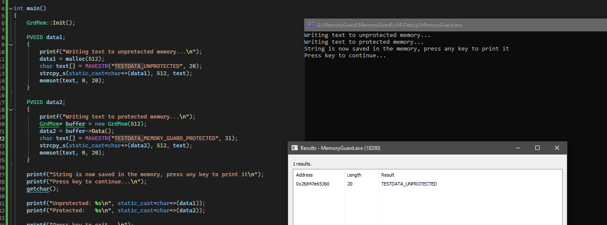

# MemoryGuard
This is a simple proof-of-concept project demonstrating how you can hide memory regions of your process from other processes. `ReadProcessMemory` internally uses `MmCopyVirtualMemory`, which fails when it encounters `PAGE_GUARD` protection. When it fails, it does not cause a page fault nor does it invoke any exception handler.

